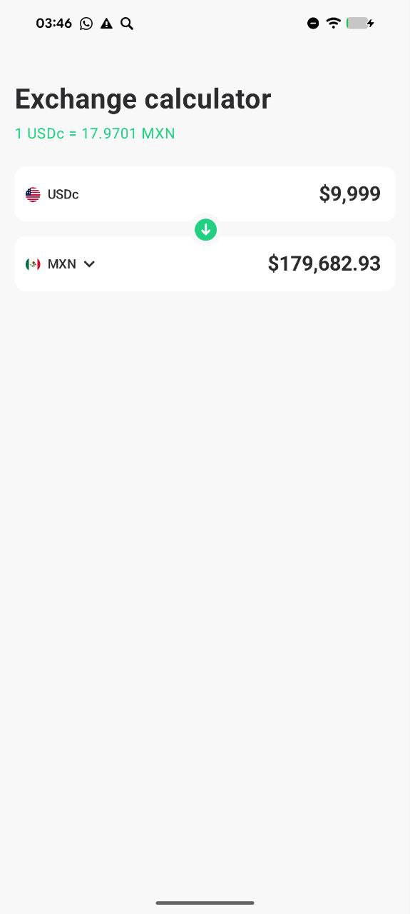
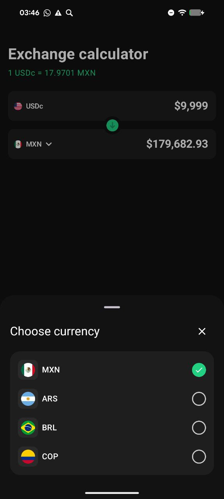
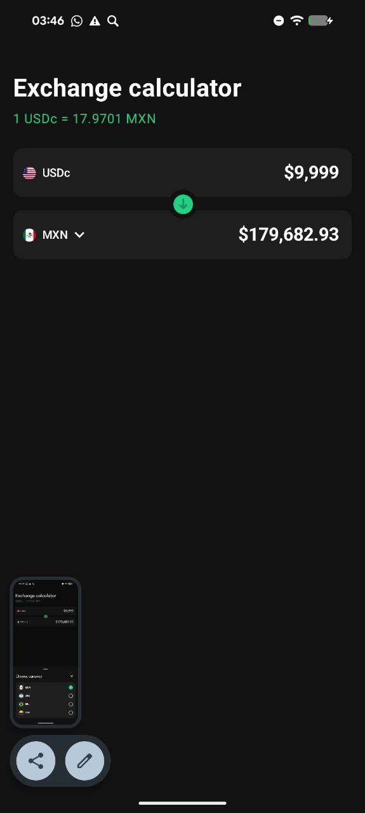

# DollarApp

**DollarApp** is a currency conversion application that displays up-to-date exchange rates and calculates converted amounts.

---

## 🏗 Architecture

The project follows **Clean Architecture + MVVM** principles using **Kotlin Coroutines and Flow**:

1. **Presentation Layer (View + ViewModel)**
    - **ViewModel (`ExchangeViewModel`)** handles UI logic: fetching data, handling form events, and calculating currency conversion.
    - Uses **StateFlow** to hold screen state (`ExchangeScreenUiState`) and **SharedFlow** for form events (`FormEvent`).
    - `viewModelScope` + coroutines handle asynchronous operations.

2. **Domain Layer (Use Case)**
    - `GetCurrenciesAndRatesUseCase` encapsulates the logic for fetching the list of currencies and their rates.
    - Separates business logic from UI and repositories.

3. **Data Layer (Repositories)**
    - `CurrencyRepository` — provides a list of available currencies.
    - `ExchangeRatesRepository` — retrieves current exchange rates (e.g., via API).
    - Repositories return data as **DTOs (`TickerDto`)**.

4. **Models**
    - `Currency` — represents a currency (code and symbol).
    - `TickerDto` — DTO for currency rates (`ask`, `bid`, `book`, `date`).
    - `ExchangeResult` — result of a conversion calculation.
    - `FormData` — current state of the conversion form.

---

## ⚡ Technologies

- **Kotlin** — primary programming language
- **Coroutines + Flow** — asynchronous data handling
- **Hilt** — dependency injection
- **StateFlow / SharedFlow** — reactive UI state
- **MVVM** — architectural pattern
- **Unit Testing**:
    - `kotlinx-coroutines-test` for testing Flow and coroutines
    - `Turbine` for Flow assertions
    - `JUnit5` for unit tests
    - `MockK` (optional) for mocking repositories

---

## 🧩 Key Features

- **BigDecimal** is used for precise currency conversion calculations.
- **InitialDataLoaded event** initializes the form after the first currencies are loaded.
- **handleEvent** manages form changes, including currency swap, amount changes, and selected currencies.
- **Flow-based UI**: `uiState` holds the current screen state (`Loading`, `Success`) and updates reactively.
- **Test-friendly**: fake repositories and test dispatchers allow unit testing without network calls or Android Main Looper.

---

